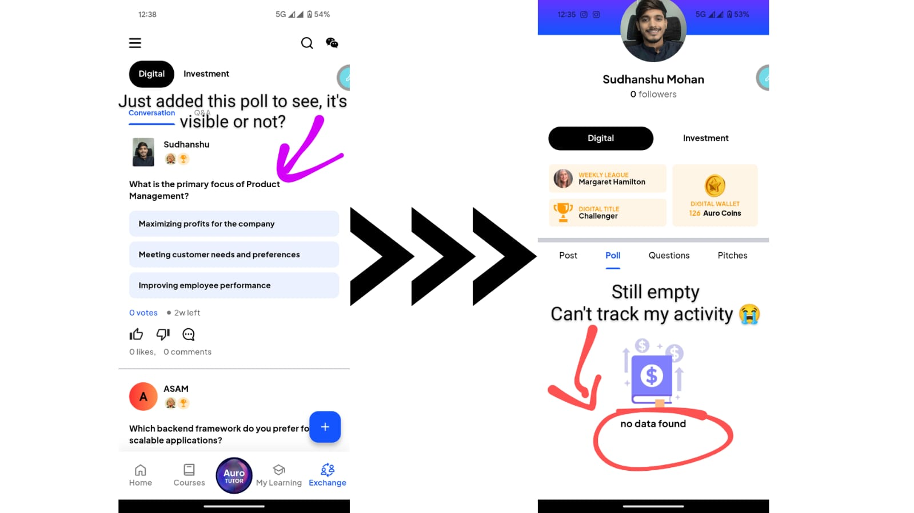

# auro-task-2_submissiom
Hey everyone! This is the second task asigned by the auro.edu as a part of hiring process for the role product manager. I analysed the existing exchange section by myself as a user and also got some user feedback in my group and identified some of the key issues (including the "My Poll" bug) and proposed to fix it.

# 📝 Feature Analysis : Enhancing the Exchange Section
## 1. Addressing the “My Poll” Bug
### Current Problem:
I encountered problems with the "My Poll" feature on the website and app. Users may be unsure about their involvement and the poll's validity if, for example, the poll progress does not change in the profile as the question and post do.
### Impact on User Experience:
Confusion: People have trouble understanding how the poll is going or if their votes were accurately recorded.

Decreased Trust: Users may start to doubt the platform's integrity if poll results are inaccurate or confusing.

Engagement Loss: If a poll feature is unresponsive, visitors can be deterred from taking part in subsequent surveys, which would reduce interactive engagement on the site.

### Proposed Fix:
Code Debugging & Real-Time Updates: Evaluate the code in detail to find the underlying issue, whether it is with state management or data retrieval, and then apply a solution to guarantee that poll votes and results are updated instantly.

Easy-to-use Interface Improvements: Redesign the poll display section to incorporate a progress indicator that makes it obvious what proportion of the survey has been completed, as well as a seamless transition between voting and results display.

Feedback Mechanism: Provide users with the ability to view a comprehensive breakdown of poll results and instant feedback (such as a confirmation message) following their vote.
#### Here is the screenshot for the issue i have encountered while using the website and the app that i have created 4 to 5 polls but i am unable to track my acctivity regarding the poll in my profile as the other questions and post do.

## 2. Introducing Community Engagement & Group Making
### Feature Overview:
A specific Community Engagement or Group Making option should be included in the Exchange area to improve collaborative learning and increase user retention. By enabling users to create or join groups based on common interests or topics, this new feature will strengthen the sense of support and community among users.
### Key Components of the New Feature:
#### Community/Group Creation:
User-Driven Groups: Give users the ability to form their own groups in which they may plan cooperative study sessions, start conversations, and establish group challenges.

Join Existing Communities: Make it simple for users to locate a community that aligns with their learning objectives by offering a list of pre-existing groups that are arranged according to subjects, course modules, or hobbies.

#### Interactive Discussion Boards:
Threaded Conversations: To keep discussions organised and understandable, enable nested comments or replies.

Polls and Quizzes in Groups: To maintain an engaging and dynamic environment, incorporate group-specific polls (until the "My Poll" problem is fixed) and mini-quizzes.

#### Incentives & Rewards:
Auro Coins for Engagement: Give users Auro Coins when they participate actively in group conversations, finish group tasks, or even assist in answering enquiries from the community.

Leaderboards & Recognition: To encourage active community members to contribute, introduce a leaderboard or badges.

## The following wireframe, designed using Figma, visually represents the improved Exchange section with the new Community feature and the fix for the 'My Poll' bug, ensuring better user engagement and retention.

##  Low-Fidelity Wireframe
I made a wireframe in Figma to show off the new features and user flow of the updated Community engagement (Exchange section).

### User Journey:
Experiencing the Poll glitch: Users may become confused by a glitch in the "My Poll" area. While a repair is being implemented, a temporary tooltip recognises the problem.

Examining the New Community Feature: In addition to "My Poll" and other forums, a new "Community" page has been added. Groups can be created or joined by users.

Getting Involved in the Community: Users may participate in group polls and quizzes, answer questions, and have discussions while earning Auro Coins.

Smooth Transition: A seamless design increases interaction and retention by tying polls and community involvement together.

# 📝 Product Analysis
## 1. Enhanced Navigation and Section Functionality
### Current Problem: 
The user experience has been fragmented as a result of users encountering irregular transitions and uncertainty between the main sections—Home, Courses, My Learning, and Exchange.

### Suggested Improvement:

Unified Navigation: Use a sticky bottom bar with labels and icons that are easy to understand on all platforms.

Consistent UI components: Make sure that the navigation components on the website, Apple App, and Android App all have the same style and animations.

Integration of User Feedback: Utilise data from user testing to improve navigation routes, cutting down on the number of steps required to reach important functions.

### Justification:
This change increases overall engagement and retention by lowering friction, enhancing usability, and facilitating rapid access to the portions consumers want.

## 2. Auro Tutor as a Floating AI Chat 
### Current Problem:
Auro Tutor's current location, in the middle of the UI, restricts its use and interferes with the learning process. Its answers are also frequently long rather than targeted.

### Suggested Improvement:

Auro Tutor may be transformed into a floating AI conversation bubble that appears on all screens.

Improved Response Logic: Set up the AI to provide succinct, context-sensitive responses with the option to provide "More Details" as needed.

### Justification:
By simulating industry-leading chat systems, a floating bubble provides constant support without disrupting content. In addition to enhancing the user experience overall, accessibility boosts tutor interaction frequency, which promotes improved learning results.

## 3. Exam Structure and Progress Tracking Enhancement
### Current Problem:
During final examinations, users have expressed perplexity, especially with the progress indicator and unclear question layout. Lack of clarity can cause anxiety to rise and progress to be misunderstood.

### Suggested Improvement:

Pre-Exam Overview: Before the test starts, clearly indicate how many questions there will be, establishing expectations.

Real-Time Progress Tracker: Provide a progress bar that updates fluidly and appropriately shows the user's progress throughout the course of the test.

User-Friendly changes: Reduce abrupt changes by designing the exam interface to provide a consistent and predictable flow.
### Justification:
User confidence is increased, frustration is decreased, and attention is maintained throughout assessments with the support of a clear test format and trustworthy progress monitoring. In the end, this raises both the perceived value of the learning process and total retention.
## Conclusion
#### These targeted improvements—streamlining navigation, enhancing Auro Tutor’s accessibility, and refining exam interfaces—are critical for elevating the overall user experience. By addressing these issues, AuroEdu can significantly boost user engagement and retention, aligning the product with modern educational technology standards.

Thank you, Auro, for giving me the opportunity to work on this project. I'm excited about the improvements proposed and am eager to hear any suggestions or questions you might have. Looking forward to the next steps!
