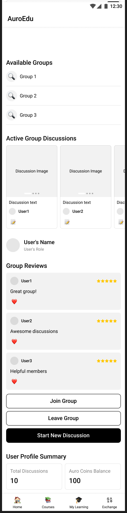

# auro-task-2_submissiom
Hey everyone! This is the second task asigned by the auro.edu as a part of hiring process for the role product manager. I analysed the existing exchange section by myself as a user and also got some user feedback in my group and identified some of the key issues (including the "My Poll" bug) and proposed to fix it.

## Feature Analysis : Enhancing the Exchange Section
### 1. Addressing the “My Poll” Bug
#### Current Problem:
I encountered problems with the "My Poll" feature on the website and app. Users may be unsure about their involvement and the poll's validity if, for example, the poll progress does not change in the profile as the question and post do.
#### Impact on User Experience:
Confusion: People have trouble understanding how the poll is going or if their votes were accurately recorded.

Decreased Trust: Users may start to doubt the platform's integrity if poll results are inaccurate or confusing.

Engagement Loss: If a poll feature is unresponsive, visitors can be deterred from taking part in subsequent surveys, which would reduce interactive engagement on the site.

#### Proposed Fix:
Code Debugging & Real-Time Updates: Evaluate the code in detail to find the underlying issue, whether it is with state management or data retrieval, and then apply a solution to guarantee that poll votes and results are updated instantly.

Easy-to-use Interface Improvements: Redesign the poll display section to incorporate a progress indicator that makes it obvious what proportion of the survey has been completed, as well as a seamless transition between voting and results display.

Feedback Mechanism: Provide users with the ability to view a comprehensive breakdown of poll results and instant feedback (such as a confirmation message) following their vote.
##### Here is the screenshot for the issue i have encountered while using the website and the app that i have created 4 to 5 polls but i am unable to track my acctivity regarding the poll in my profile as the other questions and post do.

### 2. Introducing Community Engagement & Group Making
#### Feature Overview:
